# 🏛️ GovBiz

**Ai Agent 정부지원 사업 탐색·신청 관리 플랫폼**

<a id="팀-소개"></a>

## 1. 팀 소개

<!-- 팀원 소개는 보존된 3차 프로젝트 README의 이름·GitHub 프로필을 참고했습니다. -->

<table>
  <tr>
    <td align="center">
      <br>
      <b>김건우(PM)</b><br>
      <a href="https://github.com/ilil1">
        
      </a>
    </td>
    <td align="center">
      <br>
      <b>김동섭</b><br>
      <a href="https://github.com/20220348-kim">
        
      </a>
    </td>
    <td align="center">
      <br>
      <b>이성민</b><br>
      <a href="https://github.com/lsm15111">
        
      </a>
    </td>
  </tr>
</table>

<a id="프로젝트-개요"></a>

## 2. 프로젝트 개요

### 2.1 어떤 서비스인가요?

GovBiz는 여러 기관에 흩어진 정부지원사업 공고를 모아 기업의 조건과 목적에 맞게 탐색하도록 돕는 서비스입니다.
사용자는 AI 대화 또는 직접 필터로 공고를 찾고, 추천 이유와 지원 조건을 원문에서 확인합니다.
관심 공고 저장, 신청 문서 작성, 진행 단계 관리, 중복 지원 검토와 협업 제안으로 이어갈 수 있습니다.

### 2.2 해결하려는 문제

| 사용자가 겪는 문제 | GovBiz의 해결 방법 |
|---|---|
| 기관마다 공고가 흩어져 있어 찾고 비교하기 어려움 | 공식 제공처 4곳의 공고를 수집·정규화하고 통합 검색 |
| 키워드만으로 우리 기업에 맞는 사업을 고르기 어려움 | AI 대화로 조건을 구체화하고 키워드·의미 검색을 결합 |
| AI 답변의 근거와 신청 조건을 확인하기 어려움 | 공식 본문의 인용 근거, 추천 이유와 자격 확인 정보를 함께 표시 |
| 공고 탐색 이후 문서·일정·협업을 따로 관리해야 함 | 관심함·달력·신청 문서·진행 관리·협업 기능을 연결 |
| 모델이나 프롬프트 변경의 영향을 확인하기 어려움 | 같은 평가 자료로 결과를 비교하고 검토·사용량·실패 이력을 보존 |

<a id="주요-기능"></a>

## 3. 주요 기능과 사용 흐름

### 3.1 사용자는 이렇게 이용합니다

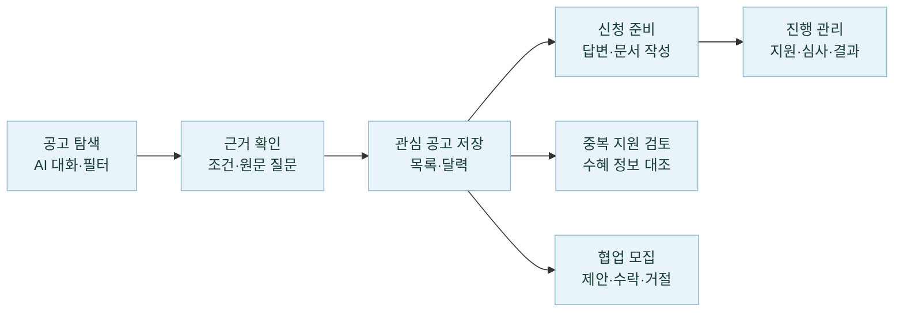

### 3.2 관리자는 이렇게 운영합니다

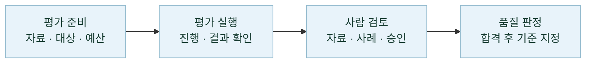

### 3.3 기능별 상세 설명

| 기능 | 현재 구현 |
|---|---|
| **공고 검색·추천** | AI 대화로 조건을 제안하고 사용자 확인 후 검색합니다. 직접 필터 검색은 키워드·지역·분야·출처·접수 상태와 K-Startup 추가 조건, 정렬·페이지 이동을 제공합니다. AI 추천은 키워드·의미 검색 후보를 결합해 관련도와 자격 근거를 표시합니다. |
| **공고 상세·원문 질문** | 접수 기간·신청 방법·공식 문의처·지원 조건을 조회하고 공식 원문으로 이동합니다. 기업마당·K-Startup 상세 HTML에 질문하면 답변과 인용 근거를 확인할 수 있습니다. |
| **관심 공고·진행 관리** | 공고 저장·해제, 목록·달력·진행 관리 보기와 신청 문서의 준비·지원·심사·결과 단계를 관리합니다. |
| **신청 문서 작성** | 공식 양식·문항 발견, 문항별 답변 저장·검토, AI 초안과 생성 작업 조회, 지원 형식의 원본 문서 작성·다운로드를 제공합니다. 모바일은 파일 저장·공유로 연결합니다. [형식별 지원 범위](docs/application-document-mcp-architecture.md) |
| **중복 지원·수혜 검토** | 선택한 공고·기존 수혜 정보를 공식 근거와 대조하고 사업쌍별 판단·인용·기관 확인 사항을 저장합니다. 비동기 분석 상태와 결과를 다시 조회할 수 있습니다. |
| **협업·파트너** | 모집글 목록·상세·작성·수정, 내 모집글, 받은·보낸 제안과 수락·거절·철회를 제공합니다. 기업 등록·사업자 상태에 따른 이용 조건을 적용합니다. |
| **계정·기업 정보** | 이메일 인증 가입·로그인, 비밀번호 재설정, 설정된 소셜 로그인, 사업자 조회·기업 등록·수정, 회원별 대화 보관·복원을 제공합니다. |
| **맞춤 리포트·알림** | 기업 조건에 맞춘 리포트 생성·조회, 수신 설정과 이메일·앱 푸시, 관심 공고 마감 N일 전 알림을 구현했습니다. 발송 설정과 수신 동의·기기 등록이 필요합니다. [리포트](docs/daily-reports.md) · [마감 알림](docs/deadline-reminders.md) |
| **GovBiz 도우미** | 이용 방법 안내, 기업 정보·협업 모집 조회, 관심 공고 묶음 질문을 처리합니다. LangGraph 도우미가 권한 범위의 읽기 전용 도구를 호출합니다. |
| **관리자·LLMOps** | 회원 조회·정지·강제 로그아웃·권한 변경·감사 기록, 작업 큐 현황과 별도 LLMOps 평가·검토·비교 기준·예산 관리를 제공합니다. |

<a id="기술-스택"></a>

## 4. 기술 스택

| 영역 | 적용 기술 |
|---|---|
| 구현 언어 | Kotlin, Python 3.12, TypeScript 6 |
| 웹 프론트엔드 | React 19, Vite 8, Tailwind CSS 4, React Router, Redux Toolkit, Zod |
| 모바일 | React Native, Expo, Expo Router |
| 업무·수집 API | Spring Boot, JDK 21, MyBatis, Flyway |
| AI API·Agent | FastAPI, OpenAI, LangChain, LangGraph, OpenAI Agents SDK |
| 평가 운영 API | Django, Django REST Framework |
| 데이터 저장·검색 | MySQL 8.4, Elasticsearch(Nori/BM25), Qdrant |
| 캐시·비동기 처리 | Redis, RabbitMQ |
| LLMOps | Langfuse, Prefect, Pandera, Evidently, pandas |
| 로컬 실행·컨테이너 | Docker Compose, Kubernetes(kind), Helm |
| 검증·이미지 관리 | GitHub Actions, GitHub Container Registry(GHCR) |
| 모노레포·공통 계약 | pnpm workspace, 웹·앱 공통 TypeScript 계약 |

버전 기준은 [루트 설정](package.json), [웹](frontend/web/package.json), [모바일](frontend/mobile/package.json),
[AI](backend/ai-service/pyproject.toml), [Ops](backend/ops-service/pyproject.toml)과 각 잠금 파일입니다.
서비스별 역할은 아래 [시스템 아키텍처](#서비스-구성)에 정리했습니다.

<a id="서비스-구성"></a>

## 5. 시스템 아키텍처

GovBiz는 **사용자 업무·공고 수집·AI 처리·평가 운영**을 독립 서비스로 나누고,
HTTP API와 비동기 메시지로 연결합니다.

<a id="서비스-연결"></a>

### 5.1 서비스 연결

**사용자 업무:** 웹·모바일은 같은 `core-service`를 사용하며, `core-service`가 `catalog-service`와 `ai-service`를 호출합니다.

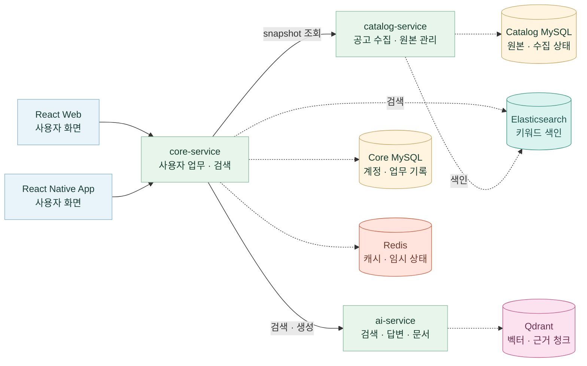

**비동기 작업:** 큐가 활성화된 업무는 `core-service`가 작업과 발행 대기 기록(Outbox)을 MySQL에 저장한 뒤
RabbitMQ로 전달합니다. 발행기와 소비자는 모두 `core-service` 내부에서 실행됩니다.

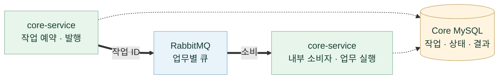

적용 업무는 **리포트 생성·메일 발송, 중복 지원 검토, 신청 양식·문항 분석, 카카오 연결 해제,
관심 공고 원문 수집·색인**입니다. 소비자는 업무에 따라 `ai-service`·공식 원문·메일 서버·카카오 API를 호출합니다.

**평가 운영:** 같은 React 웹의 관리자 화면이 `ops-service`를 호출하고, 평가 작업은 HTTP 요청 밖에서 실행됩니다.

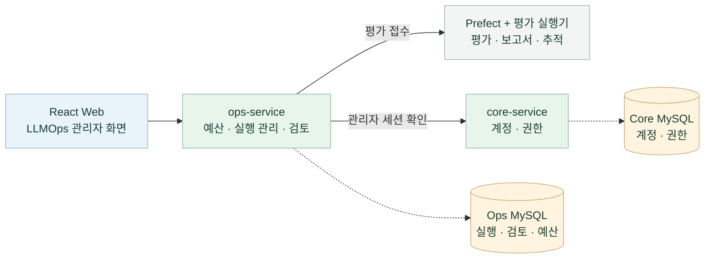

가는 실선은 서비스 호출, 굵은 실선은 큐 메시지 전달, 점선은 DB·검색 저장소·캐시 접근을 나타냅니다.
저장소는 MySQL(노랑), Qdrant(분홍), Elasticsearch(청록), Redis(주황)으로 구분합니다.
Core·Catalog·Ops의 MySQL은 같은 색을 사용하고, 서비스별 소유권은 이름으로 표시합니다.
대표적인 연결만 표시하고 응답은 생략했습니다.
웹·앱은 [Shared 패키지](docs/mobile-monorepo.md)의 업무 모델·API 계약·응답 검증을 공유합니다.

<a id="로컬-시작"></a>

### 5.2 배치 구조

업무 서비스와 LLMOps 평가·관측을 **하나의 Kubernetes(kind) 클러스터**에 배치하고,
역할에 따라 세 namespace로 구분합니다.


[이미지 크게 보기](docs/assets/architecture/govbiz-local-architecture.png?v=3d70cc68175d) · [SVG 원본](docs/assets/architecture/govbiz-local-architecture.svg?v=1c2b6da116ea)

| namespace | 배치 구성 |
|---|---|
| **`govbiz-msa` — 업무** | Core·Catalog·AI·Ops API, Ops와 같은 Pod의 `ops-sync`, 업무용 DB·검색·캐시·메시지 브로커 |
| **`govbiz-evaluation` — 평가** | Prefect·평가 실행기·`ops-artifacts`, Prefect 이력·평가 결과 PVC |
| **`govbiz-observability` — 관측** | Langfuse Web·Worker와 전용 PostgreSQL·ClickHouse·Redis·MinIO |

서비스는 **ClusterIP·내부 DNS**로 통신하고, DB·평가 결과·관측 데이터는 **PVC**에 보존합니다.
Ops가 평가를 접수하면 Prefect와 실행기가 처리하고, `ops-sync`가 상태·결과를 반영해 관리자가 검토합니다.

로컬 React/Vite 웹은 port-forward를 통해 Core·Ops API에 연결하며, React Native·Expo 모바일 앱은
기기에서 접근 가능한 API 주소를 설정해 같은 Core API를 Bearer 인증으로 호출합니다.
웹·앱은 `@govbiz/shared`의 업무 모델·API 계약을 공유하고, 관리자 Ops 화면은 웹에서 제공합니다.
Prefect·Langfuse UI도 각각 포워딩해 접근합니다.
배포는 검증된 이미지와 소스 SHA를 고정한 Helm Chart를 사용하고 **Argo CD로 수동 동기화**합니다.

[배치·저장소·접근 방식 상세](docs/assets/architecture/README-local.md) · [서비스 호출 상세](docs/architecture.md)

<a id="erd"></a>

## 6. ERD와 데이터 소유권

### 6.1 서비스 경계와 데이터 소유권

| 서비스 | 사용 저장소·관리 범위 |
|---|---|
| [core-service](backend/core-service/README.md) | Core MySQL — 계정·업무 기록·공고 복제본 관리<br/>Redis — 검색 결과·첨부 목록 캐시·문서 작업 임시 상태 관리<br/>Elasticsearch — Catalog가 준비한 키워드 색인 직접 조회 |
| [catalog-service](backend/catalog-service/README.md) | Catalog MySQL — 공고 원본·수집·공개 상태 관리<br/>Elasticsearch — 키워드 검색용 공고 문서·버전 생성·갱신 |
| [ai-service](backend/ai-service/README.md) | Qdrant — 검색 벡터·근거 청크 |
| [ops-service](backend/ops-service/README.md) | Ops MySQL — 평가·검토·예산·일정 관리 |

각 서비스는 다른 서비스의 MySQL에 직접 접근하지 않고 API로 연동합니다.
`core-service`는 `catalog-service`의 공고 원본을 받아 조회용 복제본을 유지합니다.
Elasticsearch 색인은 `catalog-service`가 생성·갱신하고, `core-service`가 직접 조회해 키워드 검색 후보를 구합니다.
Redis는 `core-service`가 검색 결과 복원, 첨부 목록 캐시, 문서 생성 잠금·임시 다운로드 권한·양식 변경 승인안 보관에 사용합니다.

아래 ERD는 현재 스키마의 **주요 엔터티와 키**를 서비스별로 요약한 것입니다.
관계선은 같은 DB 안의 외래 키(FK)를 나타내며, 서비스 사이에는 FK가 없습니다.
`PK`는 기본 키, `UK`는 유일 키이며, `||`는 1개, `o|`는 0~1개, `o{`는 0개 이상을 뜻합니다.
실선은 부모 키가 자식의 기본 키에 포함되는 관계, 점선은 포함되지 않는 관계입니다.

### 6.2 Core MySQL: 계정·관심 공고·신청 문서

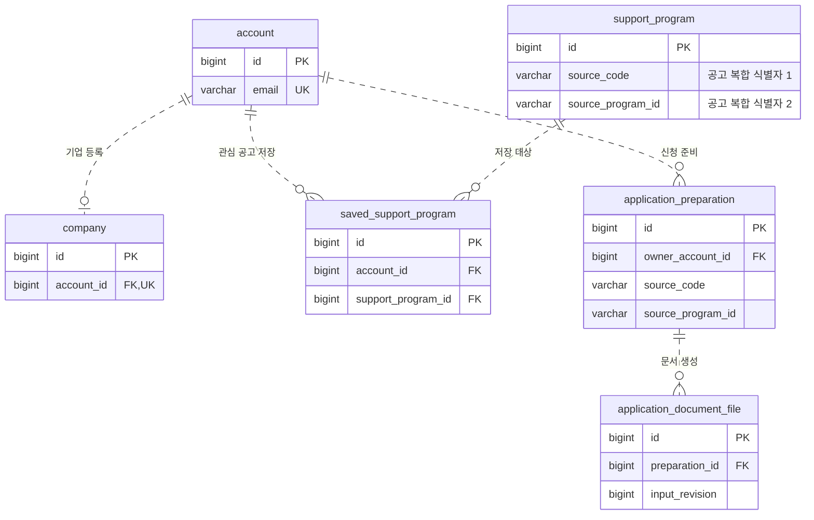

Core의 `support_program`은 Catalog에서 받은 **조회용 복제본**입니다.
`(source_code, source_program_id)`와 관심 공고의 `(account_id, support_program_id)`에는 각각 복합 UNIQUE 제약이 있습니다.
신청 준비는 공고의 복합 식별자를 저장하지만 `support_program`에 대한 FK는 두지 않습니다.
세션·협업·리포트·작업 큐 등 나머지 테이블과 전체 컬럼은 [Core Flyway migration](backend/core-service/src/main/resources/db/migration)에서 관리합니다.

### 6.3 Catalog MySQL: 공고 원본·수집·공개 상태

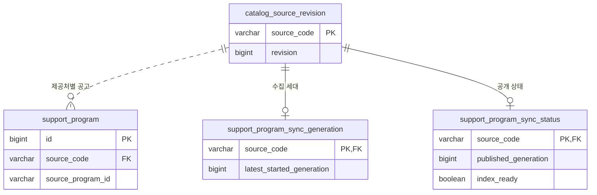

Catalog가 공고 원본과 제공처별 수집·공개 버전을 소유합니다.
공고의 `(source_code, source_program_id)`는 복합 UNIQUE이며, Core와 Catalog의 숫자 `id`가 같다고 가정하지 않습니다.
독립 카탈로그 식별용 `catalog_instance`와 전체 컬럼은 [Catalog Flyway migration](backend/catalog-service/src/main/resources/db/migration)에 정의되어 있습니다.

### 6.4 Ops MySQL: 평가·검토·비교 기준·예산

Ops는 읽기 쉽도록 **Django 모델 이름**으로 표시했습니다. FK 컬럼은 실제 저장되는 `_id` 이름입니다.

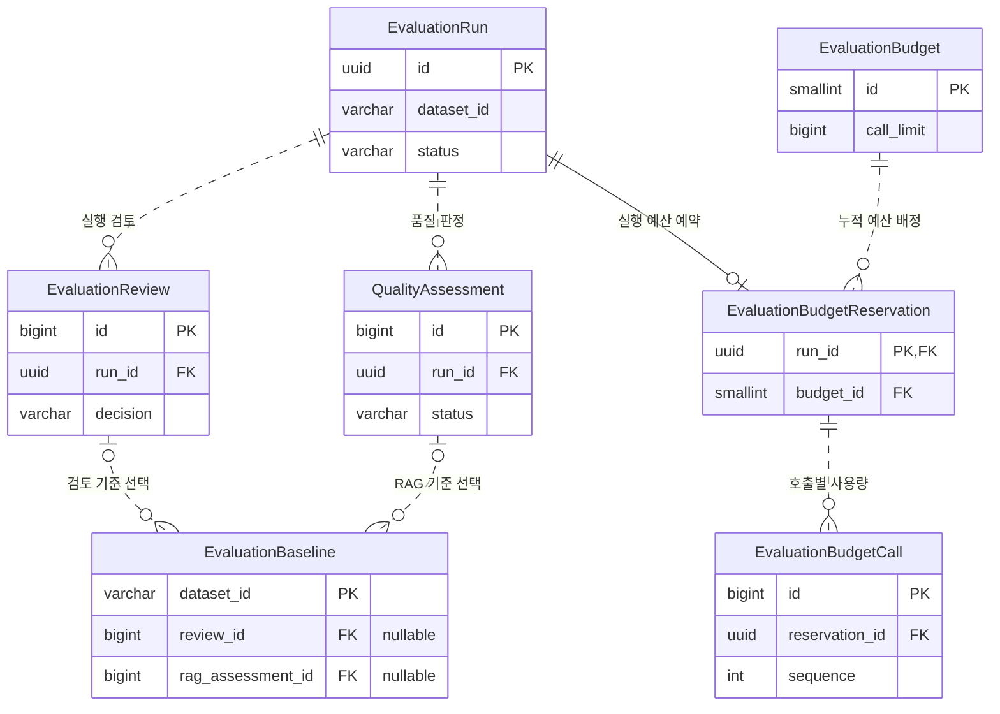

비교 기준은 자료별로 검토 또는 RAG 품질 판정 중 하나를 선택하며, 해제하면 두 참조를 비워 이력·버전을 유지합니다.
사례별 검토·정기 일정·변경 이력과 전체 제약은 [Ops 모델](backend/ops-service/apps/evaluations/models.py)과
[Django migration](backend/ops-service/apps/evaluations/migrations)에 정의되어 있습니다.
Qdrant·Elasticsearch·Redis와 평가 결과 파일의 연결은 [서비스 연결도](#서비스-연결)에서 확인할 수 있습니다.

<a id="데이터-준비"></a>

## 7. 공고 수집·색인 준비·동기화

### 7.1 공식 공고 데이터

| 제공처 | 수집 자료 | 식별 코드 |
|---|---|---|
| 기업마당 | 중앙부처·지자체·공공기관 기업지원사업 | `BIZINFO` |
| K-Startup | 창업지원사업 | `KSTARTUP` |
| 과학기술정보통신부 | 과학기술·연구개발 사업 | `MSIT` |
| 충남 온라인수출지원시스템 | 충청남도 기업 수출지원사업 | `CNTRADE_NOTICE` |

Catalog가 공식 API의 제목·기관·신청 기간·지역·분야·지원 대상·원문 URL·신청 경로를 정규화합니다.
공고는 **제공처 코드 + 원본 ID**로 구분하고, 접수 상태는 신청 기간과 서울 기준 현재 날짜로 계산합니다.

**수집·색인 준비:** `catalog-service`가 수집 결과를 검증·정규화하고, 키워드 색인과 의미 검색 벡터를 준비합니다.

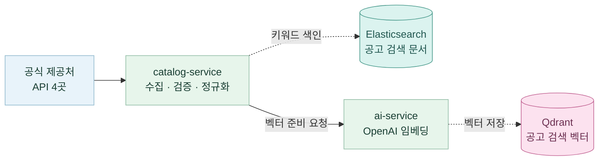

**공개·동기화:** 수집과 두 색인 준비가 모두 성공하면 Catalog MySQL에 공개합니다.
`core-service`는 인증된 HTTP snapshot을 조회·검증해 Core MySQL의 조회용 복제본을 갱신합니다.

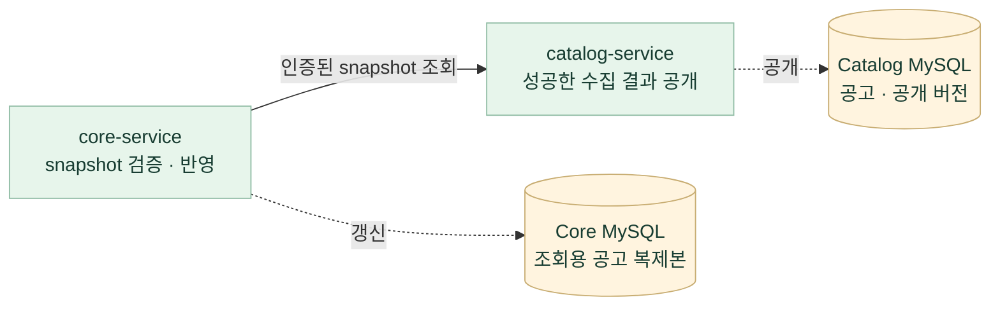

**공고 목록 갱신 방식:** 제공처의 전체 목록을 정상적으로 수집하고 응답 검증·검색 색인 준비까지 끝나면,
기존 공고는 새 내용으로 갱신하고 처음 보는 공고는 추가합니다. 이번 전체 목록에서 사라진 공고는
DB에서 삭제하지 않고 **현재 공고 목록·검색에서 제외되도록 표시**합니다. 이를 비활성화라고 합니다.

[Catalog 구현·계약](backend/catalog-service/README.md) · [서비스 분리 설명](docs/catalog-service-extraction.md) ·
[한국어 키워드 검색](docs/elasticsearch-lexical-search.md)

<a id="ai-처리-흐름"></a>

## 8. 주요 AI 기능의 처리 흐름

### 8.1 AI 대화 검색

AI가 제안한 조건을 사용자가 확인하면, 키워드·의미 검색으로 공고 후보를 찾고 AI가 추천합니다.
공고 정보는 **Core MySQL**, 키워드 검색은 **Elasticsearch**, 의미 검색은 **Qdrant**를 사용합니다.

<table width="100%">
  <tr>
    <td align="center" valign="top" width="50%">
      <strong>① 질문 입력</strong><br>
      <a href="docs/assets/screenshots/ai-search/01-new-question.jpg"></a><br>
      회사 조건과 필요한 지원을 입력합니다.
    </td>
    <td align="center" valign="top" width="50%">
      <strong>② 조건 확인</strong><br>
      <a href="docs/assets/screenshots/ai-search/02-confirm-conditions.jpg"></a><br>
      제안된 조건을 확인하고 검색합니다.
    </td>
  </tr>
  <tr>
    <td align="center" valign="top" width="50%">
      <strong>③ 추천 결과</strong><br>
      <a href="docs/assets/screenshots/ai-search/03-new-recommendations.jpg"></a><br>
      추천 공고와 확인 필요 사항을 봅니다.
    </td>
    <td align="center" valign="top" width="50%">
      <strong>④ 원문 근거 확인</strong><br>
      <a href="docs/assets/screenshots/ai-search/04-source-evidence.jpg"></a><br>
      인용 근거를 펼치고 공식 공고를 확인합니다.
    </td>
  </tr>
</table>


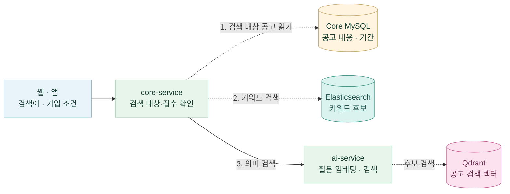

**1번은 검색에 사용할 공고를 준비하는 단계입니다.** `core-service`는 Core MySQL에서 현재 검색 가능한
공고 목록과 내용을 읽어 메모리에 보관하고, ‘접수 중만’ 조건을 적용합니다. 2·3번에서는 이 공고들을
대상으로 키워드·의미 검색을 수행해 관련 공고 ID를 찾습니다. 찾은 ID는 처음 읽어 둔 공고 내용과 연결합니다.


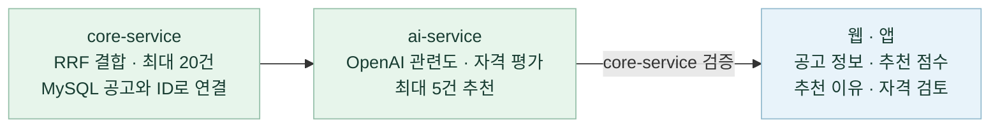

두 검색의 결과는 **제공처 코드 + 원본 ID**로 연결합니다. 예를 들어 `BIZINFO:123`이 양쪽 검색에 나오면
하나의 후보로 합치고, **RRF**로 두 검색의 순위를 결합합니다. 선택한 ID에 해당하는 공고 내용은
처음 읽어 둔 MySQL 데이터에서 찾아 AI 평가에 전달하므로, 검색 후 공고마다 DB를 다시 조회하지 않습니다.
두 색인 모두 현재 MySQL 공고의 ID·내용 버전을 기준으로 검색 범위를 제한하고 결과를 검증합니다.

| 최종 응답에 포함되는 내용 | 데이터 출처 |
|---|---|
| 제목·기관·설명·지원 대상·신청 기간·신청 경로·원문 링크 | Core MySQL에서 읽어 둔 공고 정보 |
| 접수 상태 | 저장된 신청 기간과 서울 기준 현재 날짜로 계산 |
| 추천 점수·추천 이유·자격 검토 결과 | 후보 공고에 대한 이번 검색의 AI 평가 결과를 `core-service`가 검증해 추가 |

사용자 검색은 미리 동기화된 **Core MySQL**을 사용하며 Catalog MySQL을 직접 조회하지 않습니다.
최종 추천은 최대 5건으로, 기준에 맞는 공고가 없으면 더 적거나 0건일 수 있습니다. 비로그인 사용자에게는 최대 2건을 먼저 표시합니다.
검색어가 없으면 키워드·의미 검색과 AI 평가를 생략하고, MySQL 공고를 최신순으로 최대 5건 반환합니다.
상세 공고 질문에서 원문 청크를 찾는 Qdrant 검색은 아래 [근거 기반 답변 흐름](#공고-상세의-근거-기반-답변rag)에서 별도로 설명합니다.

<a id="공고-상세의-근거-기반-답변rag"></a>

### 8.2 공고 상세의 근거 기반 답변(RAG)

RAG는 **검색한 공식 원문을 모델에게 함께 전달해 답변의 근거로 사용하는 방식**입니다.
현재 상세 공고 질문은 기업마당·K-Startup 공식 HTML 본문을 사용합니다.


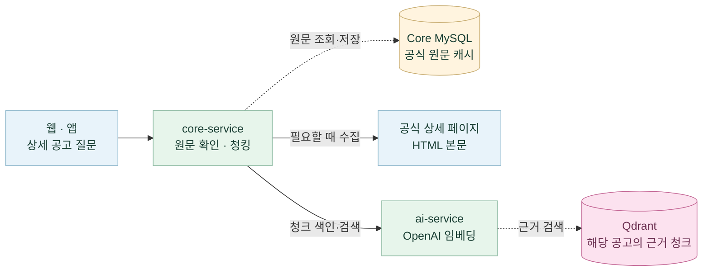


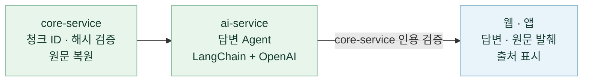

근거가 부족한 질문은 확인할 수 없다고 안내하고, 외부 서비스 장애는 오류로 반환합니다.
상세 공고의 HTML 질문과 신청 문서의 첨부파일 분석은 입력·처리 경로가 다릅니다.

### 8.3 신청 문서 작성

공식 첨부 양식에 **사용자가 입력한 답변을 기입하고 초안을 내려받는 기능**입니다.


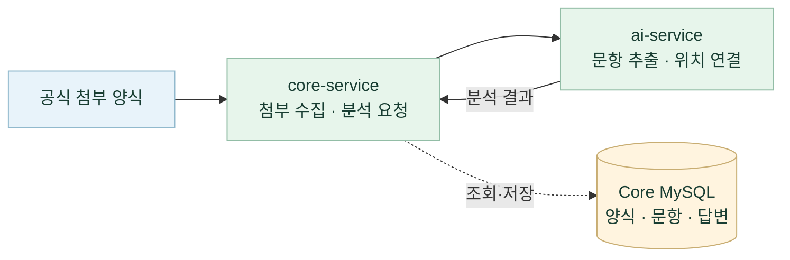


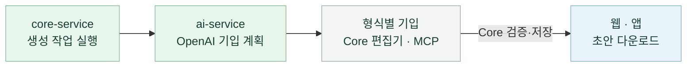

양식 조회는 저장된 분석 결과를 사용하며, 문서 생성 작업은 core-service의 워커가 실행합니다.
원본·입력 버전과 생성 결과를 검증해 파일을 Core MySQL에 저장합니다.
사용자는 초안과 자동 기입되지 않은 항목을 확인한 뒤 공식 사이트에서 최종 제출합니다.

### 8.4 GovBiz 도우미

웹 도우미가 질문을 분류해 **서비스 이용 안내, 권한 범위의 자료 조회, 관심 공고에 대한 근거 답변**을 제공합니다.


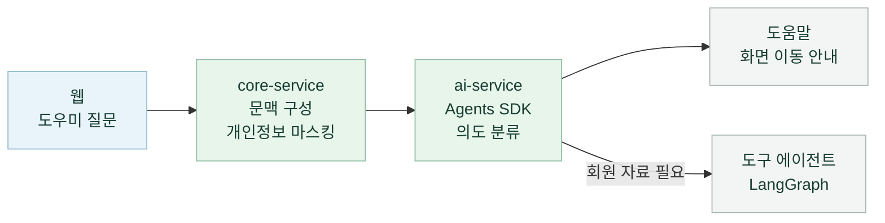


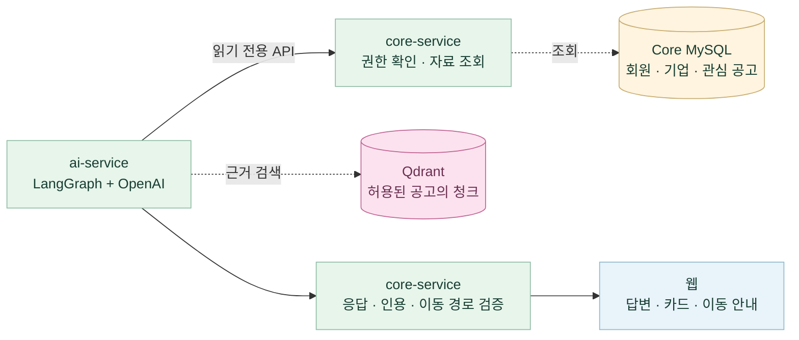

관심 공고 RAG는 core-service가 본인 관심 공고의 원문을 준비한 뒤 ai-service에 허용 청크를 전달합니다.
도움말 응답도 core-service의 검증을 거치며, 실제 검색 실행과 신청·제출은 사용자가 해당 화면에서 진행합니다.

[실제 호출 경로](docs/architecture.md) · [AI Service](backend/ai-service/README.md) ·
[문서 작성·형식별 지원 범위](docs/application-document-mcp-architecture.md)

### 8.5 관리자 Gov 에이전트

웹 `/app/chat`에서 관리자에게는 **Gov 에이전트**, 일반 회원에게는 기존 **AI 대화 검색**을 표시합니다.
현재 연결한 범위는 **검색 조건 제안 → 사용자 확인 후 검색 → 공고 선택 → 같은 대화에서 원문 근거 답변 또는 신청 준비**입니다.

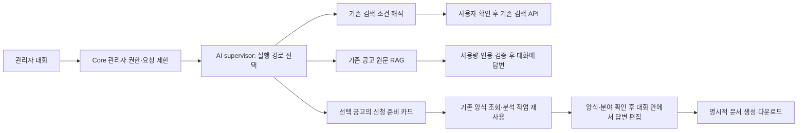

한 턴에 한 기능을 위임하는 초기 supervisor이며, A2A나 별도 Agent 서버를 추가하지 않습니다.
원문 질문은 사용자가 고른 `(sourceCode, sourceProgramId)`로만 실행합니다. 공고 선택과 인용을 기존 계정별 대화 기록에 보관하고,
기록을 열 때 AI를 재실행하지 않습니다. 원문 근거가 부족하면 그 상태를 표시합니다.
신청 준비 카드는 저장된 양식과 기존 분석 작업을 조회하며, 사용자가 분석 또는 작성 시작을 눌러야 실행합니다.
준비 건을 만들면 ID를 대화 기록에 보관하고, 같은 대화에서 기존 신청 문서 편집기와 문서 기능으로 답변 편집·문서 생성·다운로드를 이어갑니다.
기록을 다시 열 때 소유권과 현재 상태는 기존 API로 확인하며, AI 실행·문서 생성은 각 버튼을 눌러야 시작합니다. 기관에 자동 제출하지 않습니다.
중복 검토·파트너 조회 등 다른 AI 기능의 대화 통합과 여러 단계 자동 실행은 아직 연결하지 않았으며,
지원하지 않는 요청은 실행 완료로 표시하지 않고 해당 기능 화면을 이용하도록 안내합니다.

<a id="llmops-평가운영"></a>

## 9. LLMOps 평가·운영

**모델이나 프롬프트를 바꿨을 때, 같은 질문에 대한 답변 품질이 좋아졌는지 확인하는 관리자 기능**입니다.
평가 자료와 비교 대상을 고정한 뒤 결과·사용량·실패·사람의 판단을 함께 기록합니다.
예를 들어 같은 공고의 지원 대상 질문을 이전 모델과 새 모델에 적용하고,
답변에서 빠진 조건이나 잘못 인용한 근거를 확인한 후 다음 평가의 비교 기준을 정할 수 있습니다.

평가 도구는 **Langfuse + Prefect + Pandera + Evidently + pandas**로 구성하고,
**React는 운영 화면, Django는 인증·실행 관리 API**를 담당합니다.

### 9.1 다섯 도구의 역할

| 도구 | 담당하는 일 | 확인할 수 있는 결과 |
|---|---|---|
| **Langfuse** | 모델 호출과 평가 점수를 연결해 추적 | 모델·지연·토큰 사용량·오류·trace |
| **Prefect** | 평가 작업 실행과 단계·상태 관리 | 실행 상태·실패 단계·작업 로그 |
| **pandas** | 사례별 결과를 표로 정리하고 집계 | 비교·지표 계산에 사용하는 데이터 |
| **Pandera** | ID·상태·수치 범위 등 데이터 형식 검증 | 잘못된 입력·결과의 조기 거절 |
| **Evidently** | 후보와 기준의 지표를 비교해 보고서 생성 | 비교 HTML 보고서 |

프로젝트 평가기가 지표를 계산하고, Django의 품질 정책과 사람 검토로 합격·비교 기준을 결정합니다.
데이터 형식 검증이나 작업 성공만으로 답변의 정확성을 승인하지 않습니다.

### 9.2 전체 처리 흐름


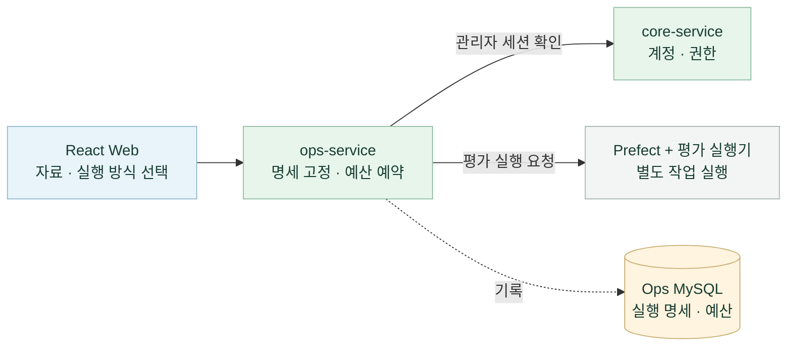

**평가 실행 요청은 관리자가 선택한 조건을 하나의 작업으로 등록해 Prefect에 전달하는 단계입니다.**
예를 들어 관리자가 저장된 답변 6건의 재평가를 요청하면, `ops-service`는 관리자 권한과
평가 자료·실행 방식·비교 대상을 확인하고 Ops MySQL에 실행 기록을 저장한 뒤 Prefect에 작업 생성을 요청합니다.
새 모델 호출이 필요한 평가에는 승인된 호출·토큰 예산도 확인하고 예약합니다.
이후 Prefect가 관리하는 별도 평가 실행기가 실제 평가와 점수·보고서 생성을 수행합니다.


```mermaid
flowchart LR
    Runner["평가 실행기<br/>한 가지 방식 선택"] --> Replay["저장 응답 재평가<br/>새 모델 호출 없음"]
    Runner --> Answer["고정 근거 새 답변<br/>OpenAI 답변 생성"]
    Runner --> Rag["새 RAG 실행<br/>질문 임베딩 · 검색 · 답변"]
    Rag -. 색인·검색 .-> Qdrant[("격리된 메모리 Qdrant<br/>평가용 청크 벡터 재사용<br/>없는 벡터만 새로 생성")]
    Replay --> Analyze["pandas + Pandera<br/>변환 · 검증 · 지표 계산"]
    Answer --> Analyze
    Rag --> Analyze
    Analyze -. 보존 .-> Artifacts[("결과 저장소<br/>답변 캡처 · 지표")]
    classDef execution fill:#f3f5f4,stroke:#a8b5af,color:#183d32
    classDef vectorDb fill:#fce2ef,stroke:#c26493,color:#6b2f50
    class Runner,Replay,Answer,Rag,Analyze,Artifacts execution
    class Qdrant vectorDb
```


```mermaid
flowchart LR
    Results["Evidently · Langfuse<br/>보고서·추적·점수"] --> Review["React Web<br/>사람 검토·기준 선택"]
    Review -->|판정·지정 요청| Ops["ops-service<br/>정책·승인 확인"]
    Ops -. 보존 .-> OpsDB[("Ops MySQL<br/>검토·판정·비교 기준")]
    classDef client fill:#e8f3fa,stroke:#91b9cd,color:#183d32
    classDef service fill:#e7f5eb,stroke:#92bda6,color:#183d32
    classDef execution fill:#f3f5f4,stroke:#a8b5af,color:#183d32
    classDef mysql fill:#fff4df,stroke:#c8ad72,color:#183d32
    class Results execution
    class Review client
    class Ops service
    class OpsDB mysql
```

1. **관리자 실행 요청:** 기존 Core 관리자 계정으로 로그인하고 React의 `/ops/evaluations`에서
   자료·실행 방식·비교 대상을 선택합니다. Django Ops가 관리자 권한과 실행 명세를 확인하고,
   새 모델 호출이 있으면 승인된 호출·토큰 한도를 검사해 예산을 예약합니다.
2. **평가 실행:** Prefect가 별도 평가 실행기에 작업을 전달하고, 실행기는 9.3에서 선택한 방식으로 평가합니다.
   Django의 HTTP 요청 안에서 모델 평가를 수행하지 않습니다.
3. **결과 분석:** 실행기는 **pandas**로 데이터를 정리하고 **Pandera**로 형식을 검증해 지표를 계산합니다.
   **Evidently**는 비교 보고서, **Langfuse**는 모델 호출 추적·사용량 관측·평가 점수를 제공합니다.
   호출 추적은 실행 중에도 수집하며, 과거 저장 응답에 없던 trace를 새로 만들지는 않습니다.
4. **사람 검토와 기준 지정:** 관리자가 자료와 사례별 답변을 검토하고 실행 검토를 승인합니다.
   검토 기록과 품질 정책으로 판정한 뒤, 합격한 결과를 관리자가 비교 기준으로 지정합니다.
   다음 평가에서는 같은 자료의 이 기준과 새 결과를 비교합니다.

### 9.3 세 가지 평가 방식

**화면에서 세 가지 실행 경로 선택하기**

관리자 메뉴의 **새 평가**(`/ops/evaluations/new`)에서 **실행 방식**과 **평가 자료**를 함께 선택합니다.
실행 방식 메뉴에는 `저장 응답 재평가`와 `새 응답 생성` 두 옵션이 있으며,
새 응답 생성은 선택한 자료가 **고정 근거 답변 자료인지 RAG 자료인지**에 따라 두 경로로 나뉩니다.
①은 공통 진입 화면이며, ②~④는 실행 목적에 따라 선택하는 세 가지 예시입니다.

<table width="100%">
  <tr>
    <th width="50%">① 새 평가 화면 열기</th>
    <th width="50%">② 저장 응답 재평가</th>
  </tr>
  <tr>
    <td align="center" valign="top">
      <a href="docs/assets/screenshots/evaluation-modes/00-new-evaluation.jpg"></a>
    </td>
    <td align="center" valign="top">
      <a href="docs/assets/screenshots/evaluation-modes/01-replay.jpg"></a>
    </td>
  </tr>
  <tr>
    <td valign="top">
      <strong>공통 시작:</strong> 관리자 메뉴 → 새 평가<br><br>
      평가 자료와 실행 방식, 비교 대상을 선택하는 화면입니다. 목적에 따라 나머지 세 컷 중 하나의 조합을 선택합니다.
    </td>
    <td valign="top">
      <strong>선택:</strong> 저장 응답 재평가 · API 호출 없음<br><br>
      저장된 기준·후보의 답변·검색 결과로 지표와 비교 보고서를 다시 생성합니다. 새 모델 호출은 없으며, 과거 응답은 당시 모델의 기록으로 표시합니다.
    </td>
  </tr>
  <tr>
    <th width="50%">③ 고정 근거로 새 답변 생성</th>
    <th width="50%">④ 고정 원문으로 새 RAG 실행</th>
  </tr>
  <tr>
    <td align="center" valign="top">
      <a href="docs/assets/screenshots/evaluation-modes/02-fixed-context-live.jpg"></a>
    </td>
    <td align="center" valign="top">
      <a href="docs/assets/screenshots/evaluation-modes/03-rag-live.jpg"></a>
    </td>
  </tr>
  <tr>
    <td valign="top">
      <strong>선택:</strong> 새 응답 생성 + 고정 근거 답변 자료<br><br>
      사진의 <strong>실제 공고 고정 근거 · 참조 보완 v3</strong>처럼 같은 질문·근거에서 모델이나 프롬프트 변경의 영향을 비교합니다. OpenAI로 답변만 새로 생성하며 검색·임베딩은 실행하지 않습니다.
    </td>
    <td valign="top">
      <strong>선택:</strong> 새 응답 생성 + RAG 평가 자료<br><br>
      사진의 <strong>실제 공고 RAG · 연속 목록 보존 v2</strong>처럼 평가용 청크 벡터를 준비하고 격리된 Qdrant에서 검색한 뒤 새 답변을 생성합니다. 같은 자료의 저장 벡터는 재사용하고 없는 벡터만 새로 만듭니다.
    </td>
  </tr>
</table>

사진은 실행 전 선택 화면입니다. 새 응답 생성은 서버의 실행 설정·예산 점검과 자료 전송·호출 예산 확인 후 요청합니다.
세 경로의 결과는 9.2의 공통 지표 계산으로 이어집니다. 저장 응답 재평가는 현재 모델의 품질을 새로 측정하지 않습니다.

**새 RAG 실행의 벡터 재사용**

청크 벡터는 기존 평가 결과 저장소에 보존하고, 실행할 때 메모리 Qdrant에 복원합니다.
운영 Qdrant의 공고 벡터를 가져오는 방식이 아니라 **평가 자료 전용 벡터를 재사용**하는 방식입니다.
같은 자료로 답변 모델이나 프롬프트를 비교할 때 문서 임베딩을 반복하지 않아 검색 조건을 유지하고 호출을 줄입니다.

| 조건 | 청크 벡터 준비 | 매번 새로 실행하는 부분 |
| --- | --- | --- |
| 처음 평가하는 자료 | 없는 벡터를 생성·저장. 같은 문서를 쓰는 사례끼리 공유 | 질문 임베딩 → 검색 → 답변 |
| 동일한 원문·청크·임베딩 설정 | 저장한 벡터 재사용 | 질문 임베딩 → 검색 → 답변 |
| 원문·청크·임베딩 모델·차원·전처리 변경 | 새 식별자의 벡터 생성·저장 | 질문 임베딩 → 검색 → 답변 |

새 평가 화면의 **청크 벡터 준비 계획**에서 사례별 재사용·생성 여부와 그에 따른 호출·토큰 상한을 확인합니다.
예를 들어 등록된 H01~H06 RAG 자료는 최초 실행에 최대 **14회**(문서 2 + 질문 6 + 답변 6),
같은 벡터를 재사용하면 최대 **12회**(질문 6 + 답변 6)를 예약합니다. 답변 전 입력 토큰 계산 요청은 별도로 기록합니다.
접수한 재사용 파일이 없어지거나 변경되면 추가 임베딩으로 대체하지 않고 중단합니다.

새 RAG 실행은 **등록된 고정 원문·청크의 검색·답변**을 평가하며, 검색·인용·답변 지표를 구분합니다.
공식 원문 재수집·Core 재청킹·운영 검색 색인의 성능은 포함하지 않습니다.
벡터 최초 생성 비용과 재사용 시 비용, 자동 지표와 사람의 답변 검토는 각각 구분해 기록·해석합니다.

Core HTTP의 저장 실행 기록도 요청·원문·검색·인용을 대조한 뒤 재평가 목록에 등록할 수 있습니다.
무료 AI 대역과 당시 실제 모델의 저장 응답을 구분하며, 이 등록·재평가로 새 모델을 호출하지 않습니다.
[Core HTTP 기록 연결](evaluation/support-program-evidence/README.md#core-http-기록을-ops-rag-평가에-연결)

### 9.4 운영 화면에서 할 수 있는 일


```mermaid
flowchart LR
    Manual["수동 평가<br/>자료 · 방식 선택"] --> Check["실행 설정·예산 확인<br/>유료 호출 시 승인 · 예약"]
    Schedule["정기 평가<br/>일정 등록 · 중지"] -->|활성 일정| Check
    Check -->|조건 충족| Run["평가 실행<br/>진행 상태 조회"]
    Run -->|완료·실패| History["실행 이력<br/>결과 · 사용량 보존"]
    Run -->|취소 요청| Cancel["후속 호출 중단<br/>발생 사용량 유지"]
    Cancel --> History
    classDef client fill:#e8f3fa,stroke:#91b9cd,color:#183d32
    classDef service fill:#e7f5eb,stroke:#92bda6,color:#183d32
    classDef execution fill:#f3f5f4,stroke:#a8b5af,color:#183d32
    class Manual,Schedule,History client
    class Check service
    class Run,Cancel execution
```


```mermaid
flowchart LR
    History["실행 이력 선택<br/>결과 · 실패 단계 확인"] -->|완료| Review["보고서·근거·답변 확인<br/>자료 · 사례별 검토"]
    History -->|응답 저장·후처리 실패| Recovery["캡처 검증·후처리 복구<br/>새 모델 호출 없음"]
    Recovery -->|복구 완료| Review
    Review --> Quality["실행 검토 승인<br/>품질 판정"]
    Quality -->|합격 후 관리자 지정| Baseline["비교 기준 지정<br/>다음 평가에 사용"]
    classDef client fill:#e8f3fa,stroke:#91b9cd,color:#183d32
    classDef service fill:#e7f5eb,stroke:#92bda6,color:#183d32
    classDef execution fill:#f3f5f4,stroke:#a8b5af,color:#183d32
    class History,Review,Baseline client
    class Quality service
    class Recovery execution
```

| 기능 | 동작 |
|---|---|
| 평가 실행·이력 조회 | 실행 전 설정과 예산을 확인하고 요청합니다. 진행 상태·실패 단계·결과·사용량·비교 보고서를 조회하며, 같은 요청 재전송으로 실행을 중복 생성하지 않습니다. |
| 근거와 답변 검토 | 질문·원문·참조 조건·후보 답변을 대조하고 사례별 판단과 사유를 저장합니다. RAG는 검색된 근거와 답변의 인용도 함께 확인합니다. |
| 품질 판정·비교 기준 | 자료 검토, 사례 검토, 실행 승인, 품질 판정과 기준 변경 이력을 보존합니다. 필요한 사람 검토가 없으면 합격·기준 지정을 차단합니다. |
| 예산·취소 | 누적·일별 호출 수와 입력·출력 토큰 한도를 관리합니다. 동시 요청에도 예약량을 합산하고, 사용량이 불명확한 호출을 0으로 정산하지 않습니다. 취소는 후속 호출을 중단하며 이미 발생한 사용량은 남습니다. |
| 실패 후처리 복구 | 모델 응답은 저장됐지만 보고서·점수 등록이 실패한 경우, 검증된 캡처로 후처리를 다시 실행합니다. 새 모델 호출 없이 원본 실패와 복구 이력을 함께 보존합니다. |
| 정기 평가 | 종료일이 있는 일별 일정을 등록·중지할 수 있습니다. 기본값은 비활성화이며, 활성화해도 동일한 승인·예산 검사를 거칩니다. |

**`COMPLETED`는 평가 작업 완료이며 품질 합격을 뜻하지 않습니다.**
품질 합격과 비교 기준 지정은 별도 단계이고, 기준은 사람이 검토한 자료 범위에서만 유효합니다.

<a id="저장소-구성"></a>

## 10. 저장소 구성

애플리케이션·평가 도구·Kubernetes 설정을 함께 관리하는 모노레포입니다.
기준 저장소는 [`SKNETWORKS-FAMILY-AICAMP/SKN34-4th-1Team`](https://github.com/SKNETWORKS-FAMILY-AICAMP/SKN34-4th-1Team), 기본 브랜치는 `main`입니다.
별도 submodule이나 두 번째 clone은 필요하지 않습니다. 서비스 프로세스·의존성·DB 책임은 분리합니다.

```text
SKN34-4th-1Team/
├─ frontend/
│  ├─ web/                   React 웹·관리자·LLMOps 화면
│  ├─ mobile/                Expo·React Native 앱
│  └─ packages/shared/       공통 업무 모델·API 계약·응답 검증
├─ backend/
│  ├─ core-service/          공개 API·사용자 업무
│  ├─ catalog-service/       공고 수집·원본·색인 공개
│  ├─ ai-service/            내부 검색·AI·문서 도구
│  └─ ops-service/           평가 운영 API·전용 DB
├─ evaluation/               검색·근거 답변·문서 등의 평가 자료·실행기
├─ infrastructure/
│  ├─ llmops/                Langfuse·Prefect·실행기·복구 도구
│  ├─ gitops/                Helm·kind·인프라 검증·기존 Argo 설정
│  └─ …                      Compose·이미지 발행·기존 AWS 배포 템플릿
├─ .github/workflows/        앱·Catalog·Ops·LLMOps·인프라 CI
├─ docs/                     기능·운영 안내와 구조도·검증 기록
├─ output/pdf/               LLMOps 사용자 가이드
├─ pnpm-workspace.yaml       웹·모바일·공통 패키지 workspace
└─ compose.yaml              로컬 통합 개발 진입점
```

<a id="문서-안내"></a>

## 11. 문서 안내

| 보고 싶은 내용 | 문서 |
|---|---|
| 전체 문서·이전 프로젝트 결과 | [문서 목록](docs/README.md) · [기술 README](docs/technical-readme.md) · [3차 프로젝트 README](docs/third-project/README.md) |
| 실행·데이터 이전 | [로컬 시작](docs/local-start.md) · [통합 Compose](docs/ops-monorepo-migration.md) · [Catalog 분리](docs/catalog-service-extraction.md) · [모노레포 통합 배경](docs/repository-integration.md) |
| 서비스 설계·호출 흐름 | [계층·책임](docs/architecture/README.md) · [호출·데이터 흐름](docs/architecture.md) · [기술·저장소 상세](docs/technology.md) |
| 웹·모바일 | [웹](frontend/web/README.md) · [모바일](frontend/mobile/README.md) · [공통 코드](docs/mobile-monorepo.md) · [앱 푸시](docs/mobile-report-push.md) |
| 백엔드 | [Core](backend/core-service/README.md) · [Catalog](backend/catalog-service/README.md) · [AI](backend/ai-service/README.md) · [Ops](backend/ops-service/README.md) |
| 신청 문서·중복 검토 | [문서 작성 구조·형식별 경계](docs/application-document-mcp-architecture.md) · [문서 도구 실행](docs/application-document-mcp-setup.md) · [중복 검토](docs/duplicate-support-review-design.md) |
| LLMOps | [사용 가이드 PDF](output/pdf/govbiz-llmops-user-guide-ko.pdf) · [실행 환경](infrastructure/llmops/README.md) · [평가 자료·지표](evaluation/support-program-evidence/README.md) · [검토 기록 재사용](docs/ops-local-review-copy.md) · [갱신·백업·복구](docs/ops-upgrade-runbook.md) |
| Kubernetes·이미지 | [현재 지원 경로](infrastructure/gitops/README.md) · [개인 개발](docs/local-fork-development.md) · [이미지 발행](docs/msa-image-release.md) · [Windows 설치](docs/windows-kubernetes-setup.md) |

각 검증 문서의 날짜·대상 커밋·환경을 함께 확인하세요. 과거 모델의 평가 결과나 배포 성공 기록을
현재 모델·모든 실행 환경의 검증 결과로 해석하지 않습니다.
